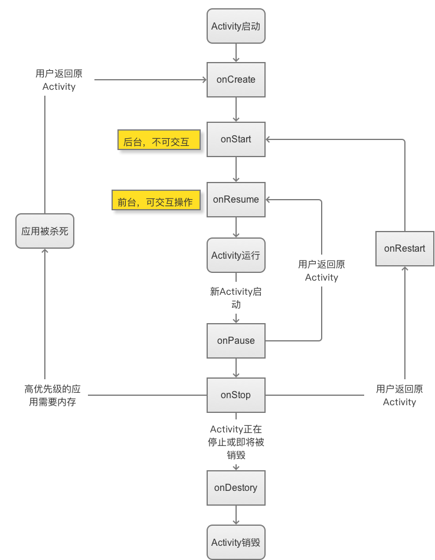

# Activity生命周期
## 典型生命周期
指在有用户参与的情况下，Activity经历的生命周期的改变。<br>
正常情况下，Activity会经历如下的生命周期:<br>

1. onCreate,表示Activity正在被创建，可以做一些初始化的工作，比如SetContentView，初始化所需要的数据。<br>
2. onRestart，表示Activity正在被重启，一般情况下，当当前Activity从不可见重新变为可见，onRestart被调用。这种情况一般是用户的行为导致的，比如用户按Home键切换到桌面，或者用户打开了一个新的Activity，当前的Activity就会暂停，接着用户又回到了这个Activity，就会出现这种情况。<br>
3. onStart,表示Activity正在被启动，即将开始，这是Activity已经可见了，但是还没有出现在前台，还无法和用户交互。<br>
4. onResume,Activity已经可见了，并且出现在前台并开始活动。<br>
5. onPause,Activity正在停止，紧接着onStop会被调用，可以做一些不耗时的操作。<br>
6. onStop，表示Activity即将停止。<br>
7. onDestory,Activity即将被销毁，可以做一些回收工作和最终的资源释放。<br>
整个生命周期如下图所示:<br>
 <br>

## 注意事项
1. 针对一个特定的Activity，第一次启动，回调为onCreate->onStart->onResume
2. 用户打开新的Activity或切换到桌面，回调为onPause->onStop。如果Activity设置了透明主题，不会回调onStop。
3. 用户再次回到原Activity，回调为onRestart->onStart->onResume 。
4. 用户按back键回退时，回调为onPause->onStop->onDestory。
5. 新Activity启动之前栈顶得Activity需要先onPause，新的Activity才启动。
6. onStart和onStop是否可见，onResume，onPause针对是否位于前台。

## 异常生命周期
Activity被系统收回或者由于当前设备的Configuration发生变化从而导致Activity被销毁重建。
### 资源相关的系统配置发生改变导致Activity被杀死并重新创建
当系统配置发生改变后，Activity被销毁，其onPause，onStop，onDestory均会被调用，同时由于Activity是在异常情况下终止的，系统会调用onSaveInstanceState来保存当前Activity的状态。这个方法的调用时机是在onStop之前，可能在onPause之前也可能在onPause之后。当Activity被重新创建后，系统会调用onRestoreInstanceState，并把Activity销毁时onSaveInstanceState方法所保存的Bundle对象同时传给onRestoreInstanceState和onCreate方法。<br>
onRestoreInstanceState与onCreate的区别就是onRestoreInstanceState一旦被调用则参数肯定不是null。
### 资源内存不足导致低优先级的Activity被杀死

Activity的优先级分为：

1. 前台Activity，正在和用户交互的Activity，优先级最高。
2. 可见但非前台Activity，比如Activity弹出了一个对话框，导致Activity可见，但是位于后台无法和用户直接交互。
3. 后台Activity，已经被暂停的Activity，比如执行了onStop，优先级最低。

### 系统配置发生变化，不重新创建的方法
设置Activity的configChanges属性。常用的有local，orientation，keyboardHidden。

# Activity启动模式
任务栈是一个先进后出的栈结构。四种启动模式：standard，singleTask，singleTop，singleIntance。
## standard
系统默认模式，每次启动一个Activity都会重新创建一个新的实例，不管这个Activity是否有实例是否存在。谁启动了Activity则activiyt就运行在启动他的那个activity所在的栈中。<br>
如果是非Activity的Context启动了Activity，则需要设置FLAG\_ACTIVITY\_NEW_TASK标记，这样启动的时候就会为它创建一个新的任务栈，这个时候待启动的Activity实际上是以singletask模式启动的。
## singleTop
栈顶复用模式，只有在Activity在栈顶有实例，则复用，如果不在栈顶则新建实例。
## singleTask
栈内复用，在同一个栈内只存在一个实例，如果已经在栈里则清除该实例顶的所有其他Activity对象，否则新建一个实例。具有清除栈顶操作。
## singleInstance
单例模式，整个应用内只有一个实例。
## 任务栈
什么是Activity所需要的任务栈？从参数TaskAffinity说起，该单词可翻译为任务相关性，这个参数表示了一个Activity所需要的任务栈的名字，默认情况下，所有Activity所需的任务栈的名称为应用的报名。TaskAffinity属性主要和SingleTask启动模式或者allowTaskReparenting属性配对使用，其他情况下没有意义。另外任务栈分为前台任务栈和后台任务栈，后台任务栈中的Activity位于暂停状态，用户可以通过切换将后台任务栈再次调到前台。<br>
当TaskAffinity和singleTask启动模式配对使用的时候，它具有该模式的Activity的目前任务栈的名称，待启动的Activity会运行在名字和TaskAffinity相同的任务栈中。
## 启动模式的指定
两种方式，1.在AndroidMenifest文件中为Activity指定，设置android:launchMode属性。2.在Intent中设置标记位，通过intent的addFlags方法来设置。<br>
两种方式区别，优先级第二种高，限定范围不同，第一种无法直接为Activity设置FLAG\_ACTIVITY\_CLEAR_TOP，第二种无法为Activity指定singleInstance模式。
## Activity的Flags

* FLAG\_ACTIVITY\_NEW_TASK 相当于为Activity指定了‘singleTask’启动模式
* FLAG\_ACTIVITY\_SINGLE_TOP 相当于制定了‘singleTop’启动模式
* FLAG\_ACTIVITY\_CLEAR_TOP 当启动时，同一个任务栈中所有的位于它上面的Activity都要出栈。这个模式一般需要和FLAG\_ACTIVITY\_NEW\_TASK配合使用，这种情况下，被启动的Activity如果已经存在，那么系统就会调用它的onNewIntent。如果被启动的Activity采用的时standard模式，则它连同它之上的Activity都要出栈，系统会创建新的Activity
* FLAG\_ACTIVITY\_EXCLUDE\_FROM_RECENTS Activity不会出现在历史Activity列表中。等同于android:excludeFromRecents="true"。
 
# IntentFilter匹配规则
Activity的启动分为显示和隐式调用。显示调用需要明确地指定启动对象的组件信息，包括包名和类名，而隐式调用则不需要明确指定组件信息，原则上一个Intent不应该既是显示调用又是隐式调用，如果二者共存的话以显示调用为主。<br>
IntentFilter中的过滤信息有action，category，data。
## action匹配规则
action是一个字符串，action的匹配规则是Intent中的action必须能够和过滤规则中得action匹配，这里说的匹配指字符串完全一样。一个过滤规则中可以有多个action那么只要Intent中的action能够和过滤规则中得任何一个相同则匹配成功。
## category匹配规则
如果Intent中又category，不管几个category，对于每一个category，它必须是过滤规则中已经定义了的category。如果Intent中没有category则仍然匹配成功。为了保证activity接收隐式调用，就必须在intent-filter中指定android.intent.catogroy.DEFAULT这个category。
## data匹配规则
如果过滤规则中定义了data，那么Intent中必须也要定义可匹配的data。<br>
data分为两部分，mimeType和URI。mimeType指媒体类型，比如image/jpeg,audio/mpeg4-generic等可以表示图片，文本，视频等不同的媒体格式。而URI中包含的数据就比较多了。URI的结构为:<br>
```javascript
<scheme>://<host>:<port>/[<path>|<pathPrefix>|<pathPattern>]
```
Scheme,URI的模式比如http，file，content等。如果URI中没有指定scheme，则整个URI的其他参数无效。<br>
Host,URI的主机名，必须有Host。<br>
Port,URI中得端口号。<br>
Path,pathPattern,pathPrefix,三个参数表示路径信息，其中path表示完整的路径信息，pathPatter也表示完整的路径信息，但是里面可以包含通配符。pathPrefix表示路径的前缀。<br>
Intent必须包含data数据，并且data数据能够完全匹配过滤规则中的某一个data。
# Fragment 生命周期
生命周期如下所示:<br>
<br>
与activity生命周期对比:<br>

## 生命周期分析
1. 当一个fragment被创建的时候，它会经历以下状态.
 * onAttach()
 * onCreate()
 * onCreateView()
 * onActivityCreated()
2. 当这个fragment对用户可见的时候，它会经历以下状态。
 * onStart()
 * onResume()
3. 当这个fragment进入“后台模式”的时候，它会经历以下状态。
 * onPause()
 * onStop()
4. 当这个fragment被销毁了（或者持有它的activity被销毁了），它会经历以下状态。
 * onPause()
 * onStop()
 * onDestroyView()
 * onDestroy() // 本来漏掉类这个回调，感谢xiangxue336提出。
 * onDetach()
5. 就像activitie一样，在以下的状态中，可以使用Bundle对象保存一个fragment的对象。
 * onCreate()
 * onCreateView()
 * onActivityCreated()
6. fragments的大部分状态都和activitie很相似，但fragment有一些新的状态。
 * onAttached() —— 当fragment被加入到activity时调用（在这个方法中可以获得所在的activity）。
 * onCreateView() —— 当activity要得到fragment的layout时，调用此方法，fragment在其中创建自己的layout(界面)。
 * onActivityCreated() —— 当activity的onCreated()方法返回后调用此方法
 * onDestroyView() —— 当fragment中的视图被移除的时候，调用这个方法。
 * onDetach() —— 当fragment和activity分离的时候，调用这个方法。
一旦activity进入resumed状态（也就是running状态），你就可以自由地添加和删除fragment了。因此，只有当activity在resumed状态时，fragment的生命周期才能独立的运转，其它时候是依赖于activity的生命周期变化的。

