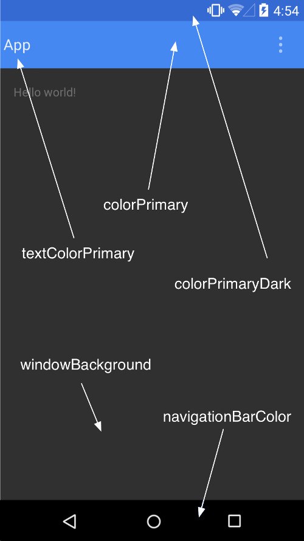

# 概述
* Attr：属性，样式的最小单元。
* Style：风格，一系列Attr的集合用于定义一个View的样式，比如height，widht，padding等
* Theme：主题，与Style作用一样，不同于Style作用于一个单独的View，而是作用于Activity或者整个应用。

Style和Theme定义方式相同，不过Style作用于View，Theme作用于Activity和Application。

# Attr
布局中的各个控件需要设置属性。这些属性除了由系统定义以外，我们开发者也可以自定义属性，并且在自定义View的时候会频繁使用。

## 定义属性
每一个空间都有layout_width属性，其在框架中得定义方式如下：<br>

```javascript
<declare-styleable name="ViewGroup_Layout">
    <attr name="layout_width" format="dimension">
        <enum name="fill_parent" value="-1" />
        <enum name="match_parent" value="-1" />
        <enum name="wrap_content" value="-2" />
    </attr>
    ...
</declare-styleable>
```
从上可以看出，layout_width可以使用三个枚举值，其中fill_parent和match_parent的value值都是-1。<br>
而textStyle的信息如下：<br>

```javascript
<attr name="textStyle">
    <flag name="normal" value="0" />
    <flag name="bold" value="1" />
    <flag name="italic" value="2" />
</attr>
```
对应了三个值，使用了flag标签，flag值可以做或操作。<br>
自己定义一个属性，在values目录下创建一个attrs.xml文件，在<resources>元素里面申明自己的<declare-styleable>表示一个属性组，再在里面加上属性就可以了。比如下面定义一个DogStyle属性组，其中三个属性一个是dogSex，一个是dogName,dogName设置为stirng，最后一个是dogColor，如下所示:<br>

```javascript
<resources>
	<declare-styleable name="DogStyle">
		<attr name="dogSex">
			<enum name="girl" value="1"/>
			<enum name="boy" value="2"/>
		</attr>
		<attr name="dogName" format="string"/>
		<attr name="dogName" format="color"/>
	</declare-styleable>
</resources>
```
attr的name表示属性的名称，format表示值格式。
## format
### reference，参考某一资源id
属性定义:<br>

```javascript
<declare-styleable name="名称">
    <attr name="background" format="reference" />
</declare-styleable>
```
属性使用:<br>

```javascript
	<ImageView
    android:layout_width="42dip"
    android:layout_height="42dip"
    android:background="@drawable/图片ID" />
```
### color 颜色值
属性定义:<br>

```javascript
<declare-styleable name="名称">
    <attr name="textColor" format="color" />
</declare-styleable>
```
属性使用:<br>

```javascript
	<ImageView
    android:layout_width="42dip"
    android:layout_height="42dip"
    textColor ="#00ff00" />
```
### boolean 布尔值
属性定义:<br>

```javascript
<declare-styleable name="名称">
    <attr name="focusable" format="boolean" />
</declare-styleable>
```
属性使用:<br>

```javascript
	<ImageView
    android:layout_width="42dip"
    android:layout_height="42dip"
    focusable ="true" />
```

### dimension 尺寸值
属性定义:<br>

```javascript
<declare-styleable name="名称">
    <attr name="layout_width" format="dimension" />
</declare-styleable>
```
属性使用:<br>

```javascript
	<ImageView
    android:layout_width="42dip"
    android:layout_height="42dip"/>
```
### float 浮点值
属性定义:<br>

```javascript
<declare-styleable name="AlphaAnimation">
    <attr name="fromAlpha" format="float" />
    <attr name="toAlpha" format="float" />
</declare-styleable>
```
属性使用:<br>

```javascript
	<alpha 
		android:fromAlpha="1.0"
		android:toAlpha="0.7"/>
```

### integer 整型值
属性定义:<br>

```javascript
<declare-styleable name="AnimatedRotateDrawable">
    <attr name="visible" />
    <attr name="frameDuration" format="integer" />
    <attr name="framesCount" format="integer" />
    <attr name="pivotX" />
    <attr name="pivotY" />
    <attr name="drawable" />
</declare-styleable>
```
属性使用:<br>

```javascript
<animated-rotate
    xmlns:android="http://schemas.android.com/apk/res/android"
    android:drawable="@drawable/图片ID"
    android:frameDuration="100"
    android:framesCount="12"
    android:pivotX="50%"
    android:pivotY="50%" />
```

### string 字符串
属性定义:<br>

```javascript
<declare-styleable name="Mapview">
    <attr name="apiKey" format="string"/>
</declare-styleable>
```
属性使用:<br>

```javascript
<com.google.android.maps.MapView
    android:layout_width="fill_parent"
    android:layout_height="fill_parent"
    android:apiKey="0jOkQ80oD1JL9C6HAja99uGXCRiS2CGjKO_bc_g" />
```
### fraction 百分数
属性定义:<br>

```javascript
<declare-styleable name="RotateDrawable">
    <attr name="visible" />
    <attr name="fromDegrees" format="float" />
    <attr name="toDegrees" format="float" />
    <attr name="pivotX" format="fraction" />
    <attr name="pivotY" format="fraction" />
    <attr name="drawable" />
</declare-styleable>
```
属性使用:<br>

```javascript
<rotate
    xmlns:android="http://schemas.android.com/apk/res/android"
    android:duration="5000"
    android:fromDegrees="0"
    android:interpolator="@anim/动画ID"
    android:pivotX="200%"
    android:pivotY="300%"
    android:repeatCount="infinite"
    android:repeatMode="restart"
    android:toDegrees="360" />
```
### enum 枚举值
属性定义:<br>

```javascript
<declare-styleable name="名称">
    <attr name="orientation">
        <enum name="horizontal" value="0" />
        <enum name="vertical" value="1" />
    </attr>
</declare-styleable>
```
属性使用:<br>

```javascript
<LinearLayout
    android:layout_width="fill_parent"
    android:layout_height="fill_parent"
    android:orientation="vertical" />
```
### flag 位或运算
属性定义:<br>

```javascript
<declare-styleable name="名称">
    <attr name="windowSoftInputMode">
        <flag name="stateUnspecified" value="0" />
        <flag name="stateUnchanged" value="1" />
        <flag name="stateHidden" value="2" />
        <flag name="stateAlwaysHidden" value="3" />
        <flag name="stateVisible" value="4" />
        <flag name="stateAlwaysVisible" value="5" />
        <flag name="adjustUnspecified" value="0x00" />
        <flag name="adjustResize" value="0x10" />
        <flag name="adjustPan" value="0x20" />
        <flag name="adjustNothing" value="0x30" />
    </attr>
</declare-styleable>
```
属性使用:<br>

```javascript
<activity
    android:name=".StyleAndThemeActivity"
    android:label="@string/app_name"
    android:windowSoftInputMode="stateUnspecified | stateUnchanged　|　stateHidden" >
    <intent-filter>
        <action android:name="android.intent.action.MAIN" />
        <category android:name="android.intent.category.LAUNCHER" />
    </intent-filter>
</activity>
```

### 需要注意的地方
属性定义时可以指定多种类型值，如：<br>
属性定义:<br>

```javascript
<declare-styleable name="名称">
    <attr name="background" format="reference|color">
</declare-styleable>
```
属性使用:<br>

```javascript
<ImageView
    android:layout_width="42dip"
    android:layout_height="42dip"
    android:background="@drawable/图片ID|#00FF00" />
```
## 自定义属性
自定义属性遵循以下几个步骤：<br>

1. 自定义一个CustomView（extends View）类
2. 编写values/attrs.xml，在其中编写styleable和item等标签元素
3. 在布局文件中CustomView使用自定义的属性（注意namespace）
4. 在CustomView的构造方法中通过TypedArray获取

### 自定义属性生命文件

```javascript
<?xml version="1.0" encoding="utf-8"?>
<resources>
    <declare-styleable name="test">
        <attr name="text" format="string" />
        <attr name="testAttr" format="integer" />
    </declare-styleable>
</resources>
```
### 自定义View 类

```javascript
package com.example.test;

import android.content.Context;
import android.content.res.TypedArray;
import android.util.AttributeSet;
import android.util.Log;
import android.view.View;

public class MyTextView extends View {

    private static final String TAG = MyTextView.class.getSimpleName();

    public MyTextView(Context context, AttributeSet attrs) {
        super(context, attrs);

        TypedArray ta = context.obtainStyledAttributes(attrs, R.styleable.test);

        String text = ta.getString(R.styleable.test_testAttr);
        int textAttr = ta.getInteger(R.styleable.test_text, -1);

        Log.e(TAG, "text = " + text + " , textAttr = " + textAttr);

        ta.recycle();
    }

}
```
### 在布局文件中使用

```javascript
<RelativeLayout xmlns:android="http://schemas.android.com/apk/res/android"
    xmlns:tools="http://schemas.android.com/tools"
    xmlns:zhy="http://schemas.android.com/apk/res/com.example.test"
    android:layout_width="match_parent"
    android:layout_height="match_parent" >

    <com.example.test.MyTextView
        android:layout_width="100dp"
        android:layout_height="200dp"
        zhy:testAttr="520"
        zhy:text="helloworld" />

</RelativeLayout>
```
styleable的name写的是test，所以说这里并不要求一定是自定义View的名字。
### AttributeSet和TypedArray
考虑自定义方法中得参数AttributeSet（eg：MyTextView(Context context, AttributeSet attrs) ）这个参数看名字就知道包含的是参数的集合，能不能通过它去获取我的自定义属性呢？<br>
AttributeSet的确保存的时View声明的所有属性，并且外面的确可以通过它获取（自定义的）属性。通过下面的代码可以非常清晰的指导如何获取属性的值。<br>

```javascript
public MyTextView(Context context, AttributeSet attrs) {
        super(context, attrs);

        int count = attrs.getAttributeCount();
        for (int i = 0; i < count; i++) {
            String attrName = attrs.getAttributeName(i);
            String attrVal = attrs.getAttributeValue(i);
            Log.e(TAG, "attrName = " + attrName + " , attrVal = " + attrVal);
        }
        // ==>use typedarray ...
    }
   输出为:
   MyTextView(4136): attrName = layout_width , attrVal = 100.0dip
	MyTextView(4136): attrName = layout_height , attrVal = 200.0dip
	MyTextView(4136): attrName = text , attrVal = helloworld
	MyTextView(4136): attrName = testAttr , attrVal = 520  
```
修改MyTextView的属性为：<br>

```javascript
<com.example.test.MyTextView
        android:layout_width="@dimen/dp100"
        android:layout_height="@dimen/dp200"
        zhy:testAttr="520"
        zhy:text="@string/hello_world" />
输出为：
MyTextView(4692): attrName = layout_width , attrVal = @2131165234
MyTextView(4692): attrName = layout_height , attrVal = @2131165235
MyTextView(4692): attrName = text , attrVal = @2131361809
MyTextView(4692): attrName = testAttr , attrVal = 520
```
通过AttributeSet获取的值，如果是引用都变成了@+数字的字符串。而如果使用TypedArray就比较简单了。 <br>

```javascript
public MyTextView(Context context, AttributeSet attrs) {
        super(context, attrs);

       TypedArray ta = context.obtainStyledAttributes(attrs, R.styleable. test);
		   String text = ta.getString(ATTR_ANDROID_TEXT);
        int textAttr = ta.getInteger(ATTR_TESTATTR, -1);
        //输出 text = Hello world! , textAttr = 520
        Log.e(TAG, "text = " + text + " , textAttr = " + textAttr);

        ta.recycle();
    }
```
TypedArray其实是用来简化我们的工作的。当然也可以使用AttributeSet获取如下所示：<br>

```javascript
//第一个参数为属性的索引号，第二个参数为默认值
	int widthDimensionId =  attrs.getAttributeResourceValue(0, -1);
   Log.e(TAG, "layout_width= "+getResources().getDimension(widthDimensionId));
```
### declare-styleable
布局文件中有一个属性为：zhy:text。而系统又有一个属性为android:text，是否可以直接在attrs中使用android:text，如下所示：<br>

```javascript
    <declare-styleable name="test">
        <attr name="android:text" />
        <attr name="testAttr" format="integer" />
    </declare-styleable>
```
使用已经定义好的属性，不需要添加format属性。在类中获取方法为ta.getString(R.styleable.test_android_text);布局文件中直接android:text="@string/hell_world"即可。<br>
当然也可以不要declare-styleable，直接定义attr。如下所示：<br>

```javascript
<?xml version="1.0" encoding="utf-8"?>
<resources>
    <attr name="testAttr" format="integer" />
    <attr name="text" format="string" />
</resources>
```
自定义类的代码改为：<br>

```javascript
package com.example.test;

import android.content.Context;
import android.content.res.TypedArray;
import android.util.AttributeSet;
import android.util.Log;
import android.view.View;

public class MyTextView extends View {
    private static final String TAG = MyTextView.class.getSimpleName();
	//属性数组
    private static final int[] mAttr = { android.R.attr.text, R.attr.testAttr };
    private static final int ATTR_ANDROID_TEXT = 0;
    private static final int ATTR_TESTATTR = 1;

    public MyTextView(Context context, AttributeSet attrs) {
        super(context, attrs);

        // ==>use typedarray
        TypedArray ta = context.obtainStyledAttributes(attrs, mAttr);

        String text = ta.getString(ATTR_ANDROID_TEXT);
        int textAttr = ta.getInteger(ATTR_TESTATTR, -1);
        //输出 text = Hello world! , textAttr = 520
        Log.e(TAG, "text = " + text + " , textAttr = " + textAttr);
        ta.recycle();
    }
}
```
也就是说attr不依赖于styleable,styleable只是为了方便attr的使用。定义一个attr就会在R文件中生成一个Id，获取这个属性时，必须调用如下代码:<br>

```javascript
int[] custom_attrs = {R.attr.custom_attr1,R.custom_attr2};
TypedArray typedArray = context.obtainStyledAttributes(set,custom_attrs);
```
而通过定义一个styleable，我们可以在R文件里自动生成一个int[]，数组里面的int就是定义在styleable里面的attr的id。所以我们在获取属性的时候就可以直接使用styleable数组来获取一系列的属性。<br>

```javascript
  <declare-styleable name="custom_attrs">   
          <attr name="custom_attr1" format="string" />
          <attr name="custom_attr2" format="string" />
  </declare-styleable>
```
获取：

```
  TypedArray typedArray = context.obtainStyledAttributes(set,R.styleable.custom_attrs);
```
使用declare-styleable的方式有利于我们我们把相关的属性组织起来，有一个分组的概念，属性的使用范围更加明确。
### obtainStyledAttributes函数获取属性
该方法的声明：

* obtainAttributes(AttributeSet set, int[] attrs) //从layout设置的属性集中获取attrs中的属性
* obtainStyledAttributes(int[] attrs) //从系统主题中获取attrs中的属性
* obtainStyledAttributes(int resId,int[] attrs) //从资源文件定义的style中读取属性
* obtainStyledAttributes (AttributeSet set, int[] attrs, int defStyleAttr, int defStyleRes)

所谓获取属性，无非就是需要两个参数：第一，我需要获取那些属性；第二：我从哪里去获取这些属性(数据源)。<br>

#### attrs
 告诉系统需要获取哪些属性的值。
#### set 
表示从layout文件中直接为这个View添加的属性的集合,如：android:layout_width="match_parent"。注意，这里面的属性必然是通过xml配置添加的，也就是由LayoutInflater加载进来的布局或者View才有这个属性集。
#### defStyleAttr 
是默认的Style，只是这里没有说清楚，这里的默认的Style是指它在当前Application或Activity所用的Theme中的默认Style，以系统中的Button为例说明。

```javascript
public Button(Context context) {
    this(context, null);
}

public Button(Context context, AttributeSet attrs) {
    this(context, attrs, com.android.internal.R.attr.buttonStyle);
}

public Button(Context context, AttributeSet attrs, int defStyle) {
    super(context, attrs, defStyle);
}
```
在Code中实例化View会调用第一个构造函数，在XML中定义会调用第二个构造函数，在Button的实现中都调用了第三个构造函数，并且defStyle的值是com.android.internal.R.attr.buttonStyle。buttonStyle是系统中定义的一个attribute，系统默认有一个Theme，比如4.0中是Theme.Holo

```javascript
<style name="Theme.DeviceDefault" parent="Theme.Holo" >
    ...
    <item name="buttonStyle">@android:style/Widget.DeviceDefault.Button</item>
    ....
</style>
```
上面是系统默认的Theme，为buttonStyle指定了一个Style

```javascript
<style name="Widget.DeviceDefault.Button" parent="Widget.Holo.Button" >
</style>

<style name="Widget.Holo.Button" parent="Widget.Button">
<item name="android:background">@android:drawable/btn_default_holo_dark</item>
    <item name="android:textAppearance">?android:attr/textAppearanceMedium</item>
    <item name="android:textColor">@android:color/primary_text_holo_dark</item>
    <item name="android:minHeight">48dip</item>
    <item name="android:minWidth">64dip</item>
</style>
```
#### defStyleRes
这个也是指向一个Style的资源ID，但是仅在defStyleAttr为0或defStyleAttr不为0但Theme中没有为defStyleAttr属性赋值时起作用。

#### NULL
里面除了指定了attrs属性集之外没有任何属性值来源，数据从哪儿来呢？原来我们可以直接在Theme中指定属性的值，那么NULL表示直接从Theme中读取属性。

#### 优先级
set>defStyleAttr(主题可配置样式)>defStyleRes(默认样式)>NULL(主题中直接指定)

### 属性中指定回调方法

定义如下的属性:<br>

```javascript
<?xml version="1.0" encoding="utf-8"?>
<resources>
    <declare-styleable name="Navbar">
        <attr name="onAction" format="string" />
    </declare-styleable>
</resources>
```
通过反射执行方法，自定义类如下:<br>

```javascript
public class Navbar extends FrameLayout {
	private Context ctx;
	private Button left_btn, right_btn;
	private TextView title;

	public Navbar(Context context) {
		super(context);
		setUp();
	}
	public void setAction(TypedArray a, View v,Context context){
		if (context.isRestricted()) {
			throw new IllegalStateException();
		}
		final String handlerName = a.getString(attr);
		if (handlerName != null) {
			v.setOnClickListener(new OnClickListener() {
				private Method mHandler;
				public void onClick(View v) {
					if (mHandler == null) {
						try {
							mHandler = getContext().getClass().getMethod(handlerName,
									View.class);
						} catch (NoSuchMethodException e) {
							throw new IllegalStateException("NoSuchMethodException");
						}
					}
					try {
						mHandler.invoke(getContext(), right_btn);
					} catch (IllegalAccessException e) {
						throw new IllegalStateException();
					} catch (InvocationTargetException e) {
						throw new IllegalStateException();
					}
				}
			});
		}
	}
	public Navbar(Context context, AttributeSet attrs) {
		super(context, attrs);
		setUp();
		TypedArray a = context.obtainStyledAttributes(attrs, R.styleable.Navbar);
		final int N = a.getIndexCount();
		for (int i = 0; i < N; ++i) {
			int attr = a.getIndex(i);
			if (attr ==  R.styleable.Navbar_onAction){
				addAction(a, right_button,context);
			}
		a.recycle();
	}

	void setUp() {
		ctx = getContext();
		addView(LayoutInflater.from(this.getContext()).inflate(R.layout.navbar, null));
		left_btn = (Button) findViewById(R.id.left_btn);
		title = (TextView) findViewById(R.id.title);
		right_btn = (Button) findViewById(R.id.right_btn);
	}
}
```
通过反射机制就可以调用指定的方法了。
# Style和Theme
## 定义Style和Theme
Theme实质上也是Style。因此两者的定义方式相同。具体的定义格式如下:<br>

```javascript
<?xml version="1.0" encoding="utf-8"?>
<resources>
    <style name="CodeFont" parent="@android:style/TextAppearance.Medium">
        <item name="android:layout_width">fill_parent</item>
        <item name="android:layout_height">wrap_content</item>
        <item name="android:textColor">#00FF00</item>
        <item name="android:typeface">monospace</item>
    </style>
</resources>
```
可以看出一个style在定义的时候需要一个name属性来被使用者识别，其中的item就是各种不同的属性与其对应的属性值。另外style还有parent属性，可以理解为类似Java的继承重写关系。<br>
一般在style中使用parent字段的继承适用于继承系统平台现有定义的style，而我们想要继承自己实现的style一般不会通过parent字段来实现，而是通过指定格式的name字段来时先，如下:<br>

```javascript
<style name="CodeFont.Red">
        <item name="android:textColor">#FF0000</item>
    </style>
```
上面的name字段值为CodeFont.Red，证明这个style继承自我们上面自定义的CodeFont style，可见我们自定义的继承关系式通过"."来实现的，在使用的时候只需要@style/CodeFont.Red即可使用该继承重写的style了，如果还想在着这个基础上继承，写法一样，具体为:<br>

```javascript
 <style name="CodeFont.Red.Big">
        <item name="android:textSize">30sp</item>
    </style>
```
使用系统已存在的属性时切记不要忘记<item name="android:inputType">前面的android:前缀，还有就是item中存在的属性不见得对所有的View都有效，比如Theme中需要的以WindowXXX开头的属性不适用于View，但是不会报错，只是View会忽略这些不适合自己的属性，应用适合自己的属性。

## 使用Style和Theme
将Style设置应用到UI上主要分为两类：<br>

* 对单个空间通过style进行引入（注意：ViewGroup的style不会向下传递到子View上，除非用theme方式)
* 对于单个Activity，Application等窗口级通过theme进行引入

在android中又许多预定义的style供我们使用，所以在使用主题时可以如下使用:<br>

```javascript
<!-- 使用系统预制style -->
<activity android:theme="@android:style/Theme.Dialog">

<!-- 使用系统预制但局部修改的style -->
<activity android:theme="@style/CustomTheme">
<color name="custom_theme_color">#b0b0ff</color>
<style name="CustomTheme" parent="android:Theme.Light">
    <item name="android:windowBackground">@color/custom_theme_color</item>
    <item name="android:colorBackground">@color/custom_theme_color</item>
</style>
``` 

使用方法有两种：

* 文件中配置，在AndroidMainfest.xml中的application和activity标签都有android:theme可以应用Theme。在布局文件中每个控件都有style属性来应用style
* 代码中配置，application和activity提供了setTheme方法用来应用Theme。需要注意的是该方法要在任何View初始化之前调用，否则不不刷新UI。

## 引用场景
### 透明状态栏
android 5.0新增了几个属性，通过在Theme中配置这些属性的值，就可实现透明状态栏效果。<br>
<br>
由此可知，在Theme中配置colorPrimaryDark的值，就可以决定状态栏的颜色。要注意的是该属性只在5.0中有作用，Theme也应该定义在values-v21中。

### 夜间模式
首先定义两套主题，如下:<br>

```javascript
<!--白天主题-->
    <style name="DayTheme" parent="Theme.AppCompat.Light.DarkActionBar">
        <item name="colorPrimary">@color/colorPrimary</item>
        <item name="colorPrimaryDark">@color/colorPrimaryDark</item>
        <item name="colorAccent">@color/colorAccent</item>
        <item name="clockBackground">@android:color/white</item>
        <item name="clockTextColor">@android:color/black</item>
    </style>

    <!--夜间主题-->
    <style name="NightTheme" parent="Theme.AppCompat.Light.DarkActionBar">
        <item name="colorPrimary">@color/color3F3F3F</item>
        <item name="colorPrimaryDark">@color/color3A3A3A</item>
        <item name="colorAccent">@color/color868686</item>
        <item name="clockBackground">@color/color3F3F3F</item>
        <item name="clockTextColor">@color/color8A9599</item>
    </style>
```
切换主题：<br>

```javascript
setTheme(R.style.NightTheme);
TypedValue textColor = new TypedValue();
Resources.Theme nightTheme = getTheme();
nightTheme.resolveAttribute(R.attr.CommTextColr,textColor,true);
mThemeText.setTextColor(textColor.resourceId);
```
> 主题切换参考[知乎和简书的夜间模式实现套路](http://www.jianshu.com/p/3b55e84742e5)

## Theme兼容性处理
新版本android添加了很多新的Theme，而老版本不兼容这些Theme,所以很多时候我们可能需要处理一下这种兼容性问题，比如在res/values/styles.xml中定义如下的Theme：<br>

```javascript
<style name="LightThemeSelector" parent="android:Theme.Light">
    ...
</style>
```
但是当我们想在android 3.0（api 11）以上使用新的Theme则可以在res/values-11/styles.xml中定义如下的Theme：<br>

```javascript
<style name="LightThemeSelector" parent="android:Theme.Holo.Light">
    ...
</style>
```
# 资源引用方法
## java文件中使用
```javascirpt
[<package_name>.]R.<resource_type>.<resource_name>
//注意：当资源在当前APP中则package_name可以省略，当为系统的资源则可换位譬如android.
```
## xml文件中引用

```javascirpt
@[<package_name>:]<resource_type>/<resource_name>
//注意：package_name的规则同上java中，不过在XML中引入不是本包资源时要注意格式，譬如引用系统的资源格式为android:textColor="@android:color/secondary_text_dark"
```

## 引用android系统预置的资源

```javascirpt
/可以引用系统所有资源，public & private
@*android:type/name
//只能引用系统public的资源
@android:type/name

//注意：没在frameworks/base/core/res/res/values/public.xml（也就是<sdk_path>\platforms\android-X\data\res\values\public.xml）中申明的资源App时不推荐使用的。
```

## 在xml中引用当前主题属性

```javascript
?[<package_name>:][<resource_type>/]<resource_name>
//资源值允许引用当前主题中的属性的值，这个属性值只能在style资源和XML中使用，随着当前主题的切换该值也在变换，该resource_name不需要自己定义，系统会自己在当前主题下寻找，常见的譬如动画中等。
```
## 在xml中创建或引用资源

```javascript
//在R.java的type内部类中添加一条静态常量id资源标识符，如果标示符（包括系统资源）已经存在则表示引用该标示符。
@+type/name
//在R.java中寻找已经定义的标识符，如果找不到则提示失败错误，一般在xml中定义有先后关系。
@type/name
//所以一般推荐直接使用+号避免不必要的意外。
```
## 命名空间

定义规则为:

```javascript
xmlns:namespace-prefix=http://schemas.android.com/apk/res/应用程序包路径
```
使用命名空间:namespace-prefix：属性。切记xmlns的定义必须放在最外层开始的标记中，比如我们Activity的xml文件的根布局中android前缀，tools前缀，自定义View的前缀等，常见的例子如下:<br>

```javascript
//android即为frameworks/base/core/res/res/values/attrs.xml中的属性
xmlns:android="http://schemas.android.com/apk/res/android"
//开发调试利器，不再过多说明
xmlns:tools="http://schemas.android.com/tools"
//Email App中res/values/attrs.xml等自定义属性
xmlns:settings="http://schemas.android.com/apk/res/com.android.email"
```

## 获取Theme中得Attr
在xml文件中获取Theme中Attr的语法如下：

```javascript
?[<package_name>:][<resource_type>/]<resource_name>
```
若是本应用中的Attr，则可以省去<package_name>。
比如，我们向把TextView的text指定为MyStyle中的myName，只需按如下设置：

```javascript
<TextView 
    . . .
    android:text="?attr/myName"/>
```
 
# Android系统自带的主题
android:theme="@android:style/Theme.Dialog" ----   Activity显示为对话框模式<br>
android:theme="@android:style/Theme.NoTitleBar" ---不显示应用程序标题栏<br>
android:theme="@android:style/Theme.NoTitleBar.Fullscreen" ---不显示应用程序标题栏,并全屏显示<br>
android:theme="Theme.Light"---背景为白色<br>
android:theme="Theme.Light.NoTitleBar"---背景为白色并无标题栏<br>
android:theme="Theme.Light.NoTitleBar.Fullscreen"---背景为白色并无标题栏,全屏<br>
android:theme="Theme.Black"---背景为黑色<br>
android:theme="Theme.Black.NoTitleBar"---背景为黑色并无标题栏<br>
android:theme="Theme.Black.NoTitleBar.Fullscreen"---背景为黑色并无标题栏,全屏<br>
android:theme="Theme.Wallpaper"---用系统桌面为应用程序背景<br>
android:theme="Theme.Wallpaper.NoTitleBar"---用系统桌面为应用程序背景并无标题栏<br>
android:theme="Theme.Wallpaper.NoTitleBar.Fullscreen"---用系统桌面为应用程序背景并无标题栏,全屏<br>
android:theme="Theme.Translucent"---透明背景<br>
android:theme="Theme.Translucent.NoTitleBar"---透明背景并无标题栏<br>
android:theme="Theme.Translucent.NoTitleBar.Fullscreen"---透明背景并无标题栏,全屏<br>
android:theme="Theme.Panel"---面板风格显示<br>
android:theme="Theme.Light.Panel"---平板风格显示 <br>

# 参考
[ANDROID为自定义VIEW添加属性](http://stormzhang.com/android/2013/08/04/android-custom-xml-attributes-for-your-custom-widgets/) <br>
[Android中自定义样式与View的构造函数中的第三个参数defStyle的意义](http://www.cnblogs.com/angeldevil/p/3479431.html) <br>
[深入理解Android之Attr&Style&Theme](http://www.jianshu.com/p/4f81e8813613) <br>
[Android 深入理解Android中的自定义属性](http://blog.csdn.net/lmj623565791/article/details/45022631) <br>
[Attr、Style和Theme详解](http://www.jianshu.com/p/dd79220b47dd)<br>
[Android系统自带样式（android:theme）](http://www.jianshu.com/p/315db614f7bf)<br>
[Android开发之Theme、Style探索及源码浅析](http://blog.csdn.net/yanbober/article/details/51015630)


