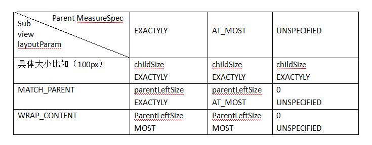
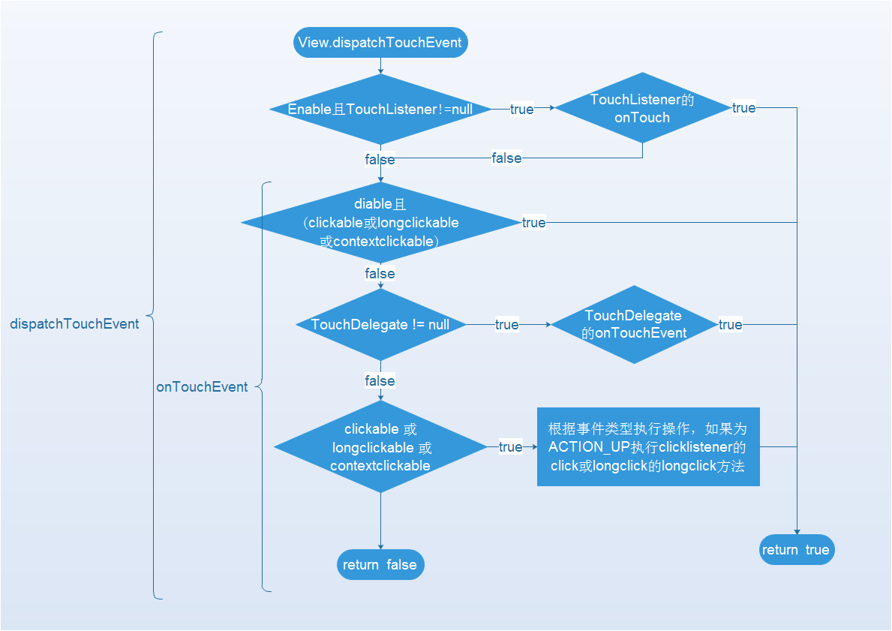
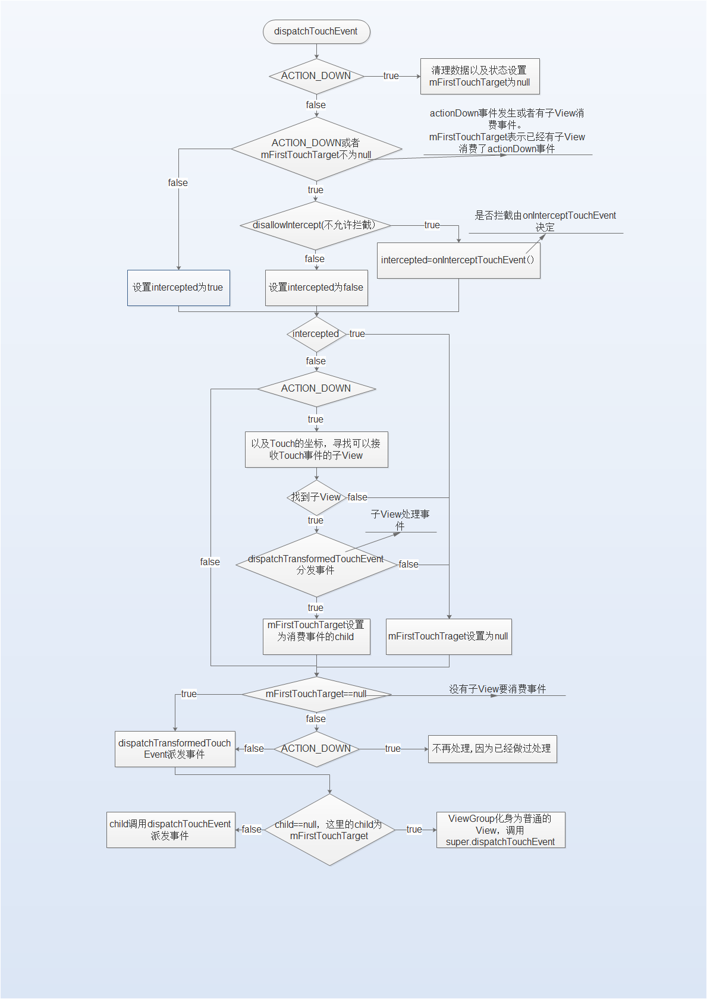

# Measure

## MeasureSpec
MeasureSpec封装了父布局传递给子View的布局要求，MeasureSpec表示宽和高，MeasureSpec由size和mode组成。<br>
通常翻译为“测量规格”，是一个32位的int数据。前两位表示测量模式，后30位表示大小<br>
MeasureSpec.getSize(measureSpec)获取size,MeasureSpec.getMode(measureSpec)获取specMode。MeasureSpec.makeMeasureSpec(size, mode);生成一个新的MeasureSpec<br>
SpecMode一共有三种: MeasureSpec.EXACTLY ， MeasureSpec.AT_MOST ， MeasureSpec.UNSPECIFIED。<br>
MeasureSpec.EXACTLY:父容器已经检测出子View所需要的精确大小，在该模式下View的大小即为specSize。<br>
MeasureSpec.AT_MOST：父容器未能检测出子View所需要的精确大小，但是指定了一个可用大小即specSize， 在该模式下，View的测量大小不能超过SpecSize。<br>
MeasureSpec.UNSPECIFIED:父容器不对子View的大小做限制。MeasureSpec.UNSPECIFIED这种模式一般用作Android系统内部，或者ListView和ScrollView等滑动控件。<br>
在ViewGroup中测量子View会调用measureChildWithMargins等方法，或者与之类似的方法：

```
	/**
     * @param child
     * 子View
     * @param parentWidthMeasureSpec
     * 父容器(比如LinearLayout)的宽的MeasureSpec
     * @param widthUsed
     * 父容器(比如LinearLayout)在水平方向已经占用的空间大小
     * @param parentHeightMeasureSpec
     * 父容器(比如LinearLayout)的高的MeasureSpec
     * @param heightUsed
     * 父容器(比如LinearLayout)在垂直方向已经占用的空间大小
     */
    protected void measureChildWithMargins(View child, int parentWidthMeasureSpec, int widthUsed,
                                           int parentHeightMeasureSpec, int heightUsed) {
        final MarginLayoutParams lp = (ViewGroup.MarginLayoutParams) child.getLayoutParams();
        final int childWidthMeasureSpec =
                  getChildMeasureSpec(parentWidthMeasureSpec, mPaddingLeft + mPaddingRight +
                                      lp.leftMargin + lp.rightMargin + widthUsed, lp.width);
        final int childHeightMeasureSpec =
                  getChildMeasureSpec(parentHeightMeasureSpec, mPaddingTop + mPaddingBottom +
                                      lp.topMargin + lp.bottomMargin + heightUsed, lp.height);
        child.measure(childWidthMeasureSpec, childHeightMeasureSpec);
    }
```
该方法要测量子View传进来的参数却包含了父容器的宽的MeasureSpec，父容器在水平方向已经占用的空间大小，父容器的高的MeasureSpec，父容器在垂直方向已经占用的空间大小等父View相关的信息。这在一定程度体现了：父View影响着子View的MeasureSpec的生成。<br>
流程为：得到子View的layoutParams，得到子View的宽的MeasureSpec，得到子View的高的MeasureSpec，测量子View。<br>
其中获取子View的MeasureSpec代码如下：
```javascript
/**
* spec为父View的MeasureSpec，
* padding表示宽或高已经使用的大小，
* childDimension表示子View的LayoutParams中定义的宽或高
*/
 public static int getChildMeasureSpec(int spec, int padding, int childDimension) {
     //获取父View的Mode或size。
        int specMode = View.MeasureSpec.getMode(spec);
        int specSize = View.MeasureSpec.getSize(spec);
        //获取可用的size
        int size = Math.max(0, specSize - padding);
        
        int resultSize = 0;
        int resultMode = 0;

        switch (specMode) {
            //父View的Mode为精确
            case View.MeasureSpec.EXACTLY:
                if (childDimension >= 0) {
                    resultSize = childDimension;
                    resultMode = View.MeasureSpec.EXACTLY;
                } else if (childDimension == LayoutParams.MATCH_PARENT) {
                    resultSize = size;
                    resultMode = View.MeasureSpec.EXACTLY;
                } else if (childDimension == LayoutParams.WRAP_CONTENT) {
                    resultSize = size;
                    resultMode = View.MeasureSpec.AT_MOST;
                }
                break;

            case View.MeasureSpec.AT_MOST:
                if (childDimension >= 0) {
                    resultSize = childDimension;
                    resultMode = View.MeasureSpec.EXACTLY;
                } else if (childDimension == LayoutParams.MATCH_PARENT) {
                    resultSize = size;
                    resultMode = View.MeasureSpec.AT_MOST;
                } else if (childDimension == LayoutParams.WRAP_CONTENT) {
                    resultSize = size;
                    resultMode = View.MeasureSpec.AT_MOST;
                }
                break;

            case View.MeasureSpec.UNSPECIFIED:
                if (childDimension >= 0) {
                    resultSize = childDimension;
                    resultMode = View.MeasureSpec.EXACTLY;
                } else if (childDimension == LayoutParams.MATCH_PARENT) {
                    resultSize = View.sUseZeroUnspecifiedMeasureSpec ? 0 : size;
                    resultMode = View.MeasureSpec.UNSPECIFIED;
                } else if (childDimension == LayoutParams.WRAP_CONTENT) {
                    resultSize = View.sUseZeroUnspecifiedMeasureSpec ? 0 : size;
                    resultMode = View.MeasureSpec.UNSPECIFIED;
                }
                break;
        }
        return View.MeasureSpec.makeMeasureSpec(resultSize, resultMode);
    }
```
这样就可以根据父的MeasureSpec，child的Layoutparams决定子View的MeasureSpec。通过上面的代码可以得到如下的一个父View的MeasureSpec和子View本身的布局决定的子View的MeasureSpec的表格<br>

也就是说，只要子View设置了具体的宽高，则得到的MeasureSpec必定specMode为EXACTLY,size为指定的宽高。当子View为Match_parent，或wrap_content时，如果父View的measureMode不是UNSPECIFIED，则size为父View剩余的空间，默认MeasureMode为AT_MOST，如果父View的MeasureMode为EXACTLY且子View为MATCH_PARENT则子View的Measuremode
为EXACTLY,如果父View的MeasureMode为UNSPECIFIED则子View的size为0，且MeasureMode为UNSPECIFIED。

# layout 
layout方法的参数为View的左上右下坐标，首先会设置其在父View中的位置，然后会调用onLayout方法。ViewGroup中的onLayout方法为抽象方法，在其子类中实现。<br>
在onLayout方法中会调用子view的layout方法，这样就设置了子View的位置。<br>
自定义ViewGroup,必须重写onMeasure，进行子View的测量，然后重写onLayout，设置子View的位置。<br>
一些问题：<br>

1. 获取View的测量大小measuredWidth和measuredHeight的时机:在某些复杂或者极端的情况下系统会多次执行measure过程，所以在onMeasure()中去获取View的测量大小得到的是一个不准确的值。为了避免该情况，最好在onMeasure()的下一阶段即onLayout()中去获取。 
2. getMeasuredWidth()和getWidth()的区别: 在绝大多数情况下这两者返回的值都是相同的，但是结果相同并不说明它们是同一个东西。 首先，它们的获取时机是不同的。在measure()过程结束后就可以调用getMeasuredWidth()方法获取到View的测量大小，而getWidth()方法要在layout()过程结束后才能被调用从而获取View的实际大小。 .其次，它们返回值的计算方式不同。 getMeasuredWidth()方法中的返回值是通过setMeasuredDimension()方法得到的，这点我们之前已经分析过，在此不再赘述；而getWidth()方法中的返回值是通过View的右坐标减去其左坐标(right-left)计算出来的。 

在measure中测量了View的大小，在layout阶段确定了View的位置。 
# draw
调用Canvas，paint的各种方法进行绘制。

# 自定义View
自定义View有以下几种常见方式：

1. 直接继承自View 
在使用该方式实现自定义View时通常的核心操作都在onDraw( )当中进行。但是，请注意，在分析measure部分源码的时候，我们提到如果直接继承自View在onMeasure( )中要处理view大小为wrap_content的情况，否则这种情况下的大小和match_parent一样。除此以为，还需要注意对于padding的处理。

2. 继承自系统已有的View 
比如常见的TextView，Button等等。如果采用该方式，我们只需要在系统控件的基础上做出一些调整和扩展即可，而且也不需要去自己支持wrap_content和padding。

3. 直接继承自ViewGroup 
如果使用该方式实现自定义View，请注意两个问题 
第一点： 
在onMeasure( )实现wrap_content的支持。这点和直接继承自View是一样的。 
第二点： 
在onMeasure( )和onLayout中需要处理自身的padding以及子View的margin

4. 继承自系统已有的ViewGroup 
比如LinearLayout，RelativeLayout等等。如果采用该方式，那么在3中提到的两个问题就不用再过多考虑了，简便了许多。


# 事件
## View事件处理



TouchListener的优先级高于onTouchEvent，clickListener和longClickListener在onTouchEvent方法中执行，且在ACION_UP时执行。

## ViewGroup事件处理



事件是由Activity-->ViewGroup---->View,事件消费是由View---->Viewgroup--->Activity的顺序传递的。<br>
在Touch事件的传递过程中，如果上一级拦截了Touch那么其下一级就无法在收到Touch事件。<br> 
在Touch事件的消费过程中，如果下一级消费Touch事件那么其上一级就无法处理Touch事件。<br>

1. 首先判断是否为ACTION_DOWN，如果是则需要重置，同时设置mFirstTouchTarget为null。
2. 判断是否需要拦截<br>
 2.1 如果是ACTION_DOWN 或者mFirstTouchTarget不是null，则需要根据是否禁止拦截来设置是否拦截，如果不允许拦截则需要根据onInterceptTouchEvent方法记来设置intercepted，如果允许拦截则设置intercepted为true。<br>
 2.2 如果不是ACTION_DOWN且mFirstTouchTarget是null，则设置intercepted为true。<br>
3. 根据是否拦截intercepted处理事件<br>
 3.1 如果拦截则设置mFirstTouchTarget为null<br>
 3.2 如果不拦截判断是否为ACTION_DOWN，如果不是ACTION_DOWN则都步骤4。否则根据Touch的坐标查找一个子View，如果超找不到则设置mFirstTouchTarget为null，如果查找到则调用dispatchTranformedTouchEvent事件处理事件，如果返回false则设置mFirstTouchTarget为null，如果返回true则设置mFirstTouchTarget为处理的子child。<br>
4. 根据mFirstTouchTarget是否为null进行消息处理，如果为不是null，且不是ACION_DOWN则不做处理，如果是ACTION_DOWN则调用dispatchTransformedTouchEvent进行事件处理。如果mFirstTouchTarget为null则调用dispatchTransformedTouchEvent执行事件处理。
5.dispatchTransformedTouchEvent会根据传递进来的child是否为null进行事件处理，如果child为null，则ViewGroup调用super.dispatchTouchEvent方法，否则调用child的dispatchTouchEvent方法。

只要拦截就会调用View.dispatchTouchEvent方法，否则调用child的dispatchTouchEvent方法。<br>
dispatchTransFormedTouchEvent方法会被执行两次，一次是intercepte为false，且是ACTION_DOWN，找到子View，决定mFirstTouchTarget，另一次是在mFirstTouchTarget为null时。
### 拦截设置
1. 如果不是ACTION_DOWN，且FirstTouchTarget是null则intercepted为true。
2. 如果disallowIntercept为true（子View未禁止父View拦截），则根据onInterceptTouchEvent决定。
3. 如果disallowIntercept为false（子View禁止父View拦截），则设置intercepted为true。

### 拦截对事件处理影响
1. 如果intercepted为true，则设置mFirstTouchTarget为null。
2. 如果intercepted为false,则会根据Touch的坐标查找子View，如果找到子View则作为参数传递给dispatchTouchEvent，如果该方法返回false，则设置mFirstTouchTarget为null。否则设置则设置mFirstTouchTarget为找到的View。
3. 如果没有找到子View，则设置mFirstTouchTarget为null。

### mFirstTouchTarget影响
1. 如果mFirstTouchTarget为null，则直接调用dispatchTransFormedTouchEvent方法。
2. 如果mFirstTouchTarget不为null，则如果事件为ACTION_DOWN，则不做任何处理，因为在上面已经执行过dispatchTransFormedTouchEvent方法，否则重新调用dispatchTransFormedTouchEvent。


